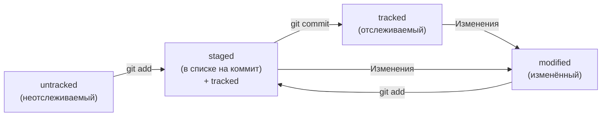

## Ключевые команды Git

#### Инициализация репозитория
```git init``` (от англ. initialize, «инициализировать») — инициализируй репозиторий.

#### Синхронизация локального и удалённого репозиториев
```git remote add origin https://github.com/YandexPracticum/first-project.git``` (от англ. remote, «удалённый» + add, «добавить») — привяжи локальный репозиторий к удалённому с URL ```https://github.com/YandexPracticum/first-project.git```;

```git remote -v``` (от англ. verbose, «подробный») — проверь, что репозитории действительно связались;

```git push -u origin main``` (от англ. push, «толкать») — в первый раз загрузи все коммиты из локального репозитория в удалённый с названием origin.

💡 Ваша ветка может называться ```master```, а не ```main```. Подправьте команду, если это необходимо.

```git push``` (от англ. push, «толкать») — загрузи коммиты в удалённый репозиторий после того, как он был привязан с помощью флага ```-u```.

#### Подготовка файла к коммиту
```git add todo.txt``` (от англ. add, **«добавить») — подготовь файл ```todo.txt``` к коммиту;

```git add --all``` (от англ. add, «добавить» + all, «всё») — подготовь к коммиту сразу все файлы, в которых были изменения, и все новые файлы;

```git add .``` — подготовь к коммиту текущую папку и все файлы в ней.

#### Создание и публикация коммита
```git commit -m "Комментарий к коммиту."``` (от англ. commit, «совершать», фиксировать» + message, «сообщение») — сделай коммит и оставь комментарий, чтобы было проще понять, какие изменения сделаны;

```git push``` (от англ. push, «толкать») — добавь изменения в удалённый репозиторий.

#### Просмотр информации о коммитах
```git log``` (от англ. log, «журнал [записей]») — выведи подробную историю коммитов;

```git log --oneline``` (от англ. log, «журнал [записей]» + oneline, «одной строкой») — покажи краткую информацию о коммитах: сокращённый хеш и сообщение.

#### Просмотр состояния файлов
```git status``` (от англ. status, «статус», «состояние») — покажи текущее состояние репозитория.

#### Добавление изменений в последний коммит
```git commit --amend --no-edit``` (от англ. amend, «исправить») — добавь изменения к последнему коммиту и оставь сообщение прежним;

```git commit --amend -m "Новое сообщение"``` — измени сообщение к последнему коммиту на Новое сообщение.

💡 Выйти из редактора Vim: нажать ```Esc```, ввести ```:qa!```, нажать ```Enter```.

#### «Откат» файлов и коммитов
```git restore --staged hello.txt``` (от англ. restore, «восстановить») — переведи файл ```hello.txt``` из состояния ```staged``` обратно в ```untracked``` или ```modified```;

```git restore hello.txt``` — верни файл ```hello.txt``` к последней версии, которая была сохранена через ```git commit``` или ```git add```;

```git reset --hard b576d89``` (от англ. reset, «сброс», «обнуление» + hard, «суровый») — удали все незакоммиченные изменения из staging и «рабочей зоны» вплоть до указанного коммита.

#### Просмотр изменений
```git diff``` (от англ. difference, «отличие», «разница») — покажи изменения в «рабочей зоне», то есть в ```modified```-файлах;

```git diff a9928ab 11bada1``` — выведи разницу между двумя коммитами;

```git diff --staged``` — покажи изменения, которые добавлены в ```staged```-файлах.

## Оформление сообщений к коммитам

У каждого коммита в Git есть сообщение — то, что передаётся после параметра ```-m```.

Например: ```git commit -m "Добавить раздел про оформление сообщений коммитов"```.

То, как написаны сообщения коммитов, тоже может подчиняться определённым правилам. Иногда эти правила продиктованы культурой команды, а иногда техническими ограничениями.

Сообщения коммитов можно сравнить с надписями на коробках в кладовке. Если надписей нет, то нужную коробку будет сложно найти: придётся заглянуть в каждую, чтобы понять, что там. А если надписи есть, то нужная найдётся сразу.

Есть общие рекомендации по тому, как правильно составить сообщение. Оно должно быть:
* относительно коротким, чтобы его было легко прочитать;
* информативным.
* оформлено в одном стиле.

## Хеш — идентификатор коммита

В процессе работы с Git вам будет часто встречаться понятие «хеш коммита». Эти странные строчки с бессмысленным (на первый взгляд) набором букв и цифр вы могли видеть, когда вызывали команду ```git log``` и выводили историю коммитов.

Хеширование (от англ. hash, «рубить», «крошить», «мешанина») — это способ преобразовать набор данных и получить их «отпечаток» (англ. fingerprint).


> Git преобразует информацию о коммитах с помощью алгоритма SHA-1 и для каждого из них рассчитывает уникальный идентификатор — хеш.

> Хеш — основной идентификатор коммита и позволяет узнать его автора, дату и содержимое закоммиченных файлов.

> Все хеши, а также таблицу соответствий ```хеш → информация о коммите``` Git хранит в папке ```.git```.

## Лог

Лог (от англ. log — «журнал [записей]»). Сокращённый лог полезен, если нужно быстро найти нужный коммит среди сотни других.


Разберём элементы, из которых состоит описание:
* строка из цифр и латинских букв после слова commit — это хеш коммита;
* Author — имя автора и его электронная почта;
* Date — дата и время создания коммита;
* в конце находится сообщение коммита.

> Можно вызвать не только полный лог, но и сокращённый — это делается командой ```git log --oneline```.

> В сокращённом логе выводятся сокращённые хеши — их можно использовать точно так же, как и полные.

## HEAD

При вызове команды ```git log``` вы также могли заметить надпись ```(HEAD -> master)``` после хеша одного из коммитов.


#### Файл HEAD

Файл ```HEAD``` (англ. «голова», «головной») — один из служебных файлов папки ```.git```. Он указывает на коммит, который сделан последним (то есть на самый новый).

В этом можно убедиться с помощью терминала. Перейдите в папку ```.git``` командой ```cd```. Посмотрите содержимое файла ```HEAD``` командой ```cat```.

```
$ pwd # посмотрели, где мы
/Users/user/dev/first-project

$ cd .git/
$ ls # посмотрели, какие есть файлы
COMMIT_EDITMSG  ORIG_HEAD  description  index  logs/     refs/
HEAD            config     hooks/       info/  objects/

$ cat HEAD # команда cat показывает содержимое файла
ref: refs/heads/master # в файле вот такая ссылка
```

Внутри ```HEAD``` — ссылка на служебный файл: ```refs/heads/master``` (или ```refs/heads/main``` в зависимости от названия ветки). Если заглянуть в этот файл, можно увидеть хеш последнего коммита.

Когда вы делаете коммит, Git обновляет ```refs/heads/master```  — записывает в него хеш последнего коммита.
Получается, что ```HEAD``` тоже обновляется, так как ссылается на ```refs/heads/master```.

> Вместо хеша последнего коммита можно написать слово HEAD — Git вас поймёт.

## Статусы файлов в Git

Одна из ключевых задач Git — отслеживать изменения файлов в репозитории. Для этого каждый файл помечается каким-либо статусом. Рассмотрим основные.

* ```untracked``` (англ. «неотслеживаемый»)
Мы говорили, что новые файлы в Git-репозитории помечаются как ```untracked```, то есть неотслеживаемые. Git «видит», что такой файл существует, но не следит за изменениями в нём. У ```untracked```-файла нет предыдущих версий, зафиксированных в коммитах или через команду ```git add```.

* ```staged``` (англ. «подготовленный»)
После выполнения команды ```git add``` файл попадает в ```staging area``` (от англ. stage — «сцена», «этап [процесса]» и area — «область»), то есть в список файлов, которые войдут в коммит. В этот момент файл находится в состоянии ```staged```.

В одном из предыдущих уроков мы сравнили коммит с фотографией. Можно развить эту аналогию и сказать, что команда ```git add``` добавляет персонажей (текущее содержимое файла или нескольких файлов) на сцену (англ. stage) для общей фотографии, а ```git commit``` делает снимок всей сцены целиком. 

* ```tracked``` (англ. «отслеживаемый»)

Состояние ```tracked``` — это противоположность ```untracked```. Оно довольно широкое по смыслу: в него попадают файлы, которые уже были зафиксированы с помощью ```git commit```, а также файлы, которые были добавлены в staging area командой ```git add```. То есть все файлы, в которых Git так или иначе отслеживает изменения.

* ```modified``` (англ. «изменённый»)

Состояние ```modified``` означает, что Git сравнил содержимое файла с последней сохранённой версией и нашёл отличия. Например, файл был закоммичен и после этого изменён.

💡 Для файлов в состояниях ```staged``` и ```modified``` обычно не указывают, что они также ```tracked```, потому что это состояние подразумевается.

#### Типичный жизненный цикл файла в Git



1. Файл только что создали. Git ещё не отслеживает содержимое этого файла. Состояние: ```untracked```.
2. Файл добавили в staging area с помощью ```git add```. Состояние: ```staged``` (+ ```tracked```).
3. Возможно, изменили файл ещё раз. Состояния: ```staged```, ```modified``` (+ ```tracked```).
4. Обратите внимание: ```staged``` и ```modified``` у одного файла, но у разных его версий.
5. Ещё раз выполнили ```git add```. Состояние: ```staged``` (+ ```tracked```).
6. Сделали коммит с помощью ```git commit```. Состояние: ```tracked```.
7. Изменили файл. Состояние: ```modified``` (+ ```tracked```).
8. Снова добавили в staging area с помощью ```git add```. Состояния: ```staged``` (+ ```tracked```).
9. Сделали коммит. Состояния: ```tracked.```
10. Повторили пункты 4−7 много-много раз.

Подытожим:
> Статусом ```untracked``` помечается файл, о существовании которого Git знает, но не следит за изменениями в нём. Этот статус — противоположность ```tracked```, в который попадают все файлы, отслеживаемые Git.

> Файл переходит в статус ```staged``` после выполнения ```git add```.

> Статус ```modified``` означает, что файл был изменён.

> Большинство файлов в проектах «шагает» по следующему циклу: «изменён» → «добавлен в список на коммит» → «закоммичен» → «изменён» → и так далее.
